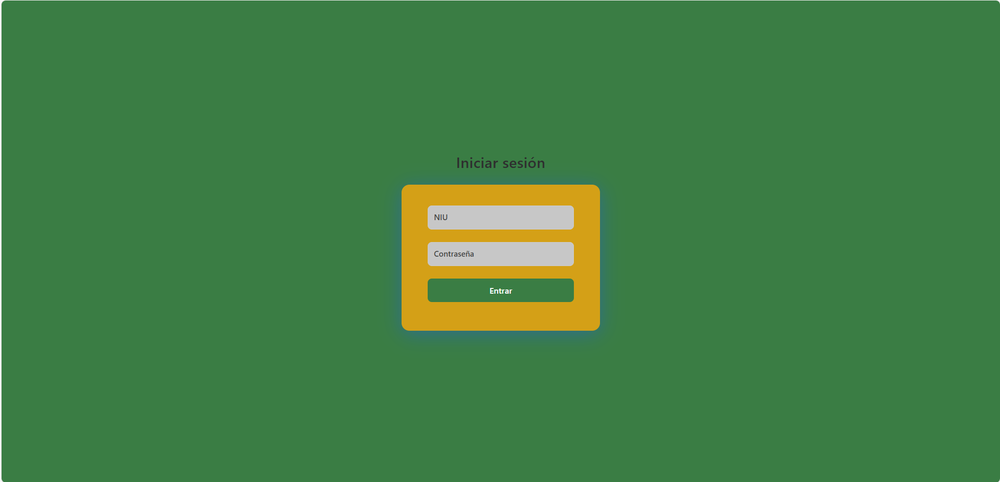
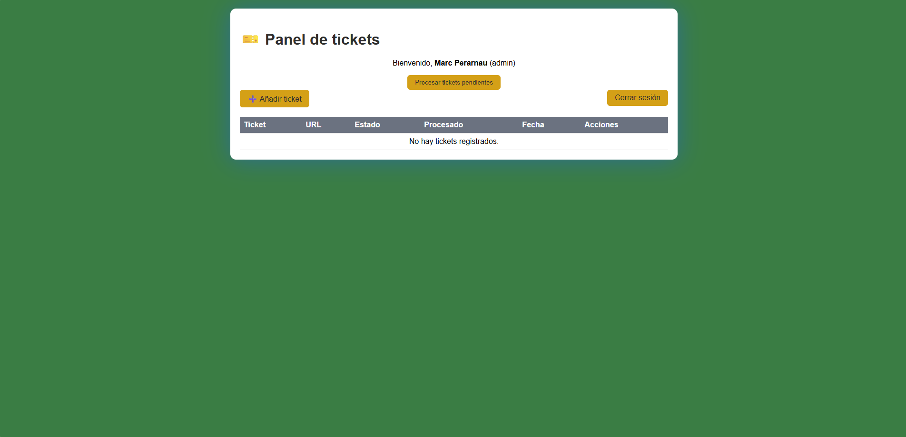
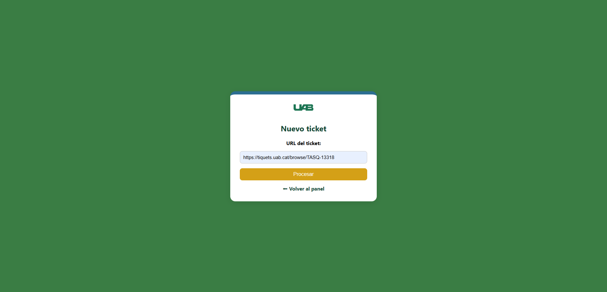
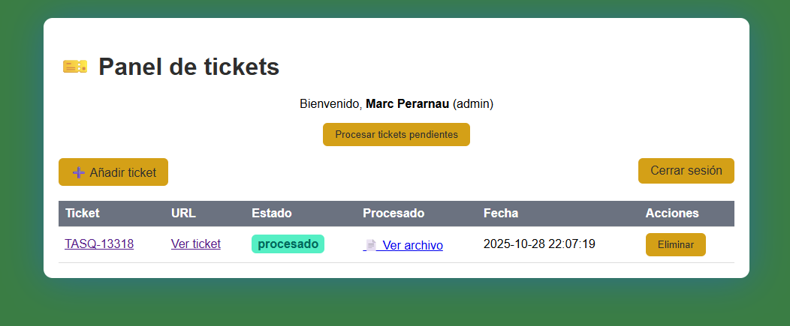

# FileFlow

> Plataforma web desarrollada para automatizar las tareas internas (TASQ) del **Centro de Asistencia y Servicios (CAS)** de la **Universitat Autònoma de Barcelona (UAB)**.  
> El sistema permite gestionar, procesar y visualizar tareas del Jira de forma más ágil mediante una interfaz web intuitiva y herramientas de automatización en Python.

---

## 🚀 Características principales

- 🔐 **Autenticación de usuarios** con roles (admin / técnico).  
- 🧾 **Automatización de TASQ** mediante scripts en Python integrados al flujo web.  
- 📊 **Visualización de tareas y estado** de cada proceso.  
- ⚙️ **Gestión centralizada** de datos obtenidos del Jira CAS.  
- 🧠 **Interfaz responsive** y adaptable para uso interno en red UAB.  
- 💾 **Conexión MySQL** para persistencia de información y logs.

---

## 🧰 Tecnologías utilizadas

| Tecnología | Uso principal |
|-------------|----------------|
| **HTML / CSS** | Estructura y estilo del sitio web |
| **Python** | Automatización de tareas y conexión con Jira |
| **Librerías Python** | `selenium`, `requests`, `os`, `re`, etc. |
| **MySQL** | Base de datos para usuarios y registros |
| **PHP** | Integración backend con la base de datos |
| **JavaScript (opcional)** | Interactividad en la interfaz |
| **XAMPP / Apache** | Entorno de desarrollo local |

---

## ⚙️ Instalación y configuración

1. **Clonar el repositorio:**
   ```bash
   git clone https://github.com/DevLabs/automatizacion-tasq-cas-uab.git
   cd automatizacion-tasq-cas-uab

2. **Configurar la base de datos:**
- Crear una base de datos `tasq_uab` en MySQL.
- Importar el archivo `database.sql`.
- Editar `db.php` con las credenciales correctas:

```PHP
$host = 'localhost';
$user = 'root';
$pass = '';
$dbname = 'tasq_uab';
```
3. **Configurar Python y dependencias:**

```BASH
pip install selenium requests mysql-connector-python
```

5. **Ejecutar en entorno local (XAMPP):**
- Iniciar Apache y MySQL.
- Acceder desde el navegador:
```
http://localhost/fileflow
```
---

## 📁 Estructura del proyecto
```bash
FileFlow/
├── index.php                
├── login.php                
├── logout.php
├── crear_usuario.php
├── delete_ticket.php
├── download_doc.php               
├── process_ticket.py                
├── db.php
├── procesados/
├── uploads/               
├── css/
│   └── colores.css
│   └── login.css         
├── image/
│   ├── uablogo.png
│   └── screenshots/                 
└── drivers/
│   └── msedgedriver.exe
└── database.sql  
```

---

## 🖼️ Capturas de pantalla

### Login 



### Menu



### Subir tiquet



### Procesar tiquet



---

## Referencia de Colores

| Color             | Hex                                                                |
| ----------------- | ------------------------------------------------------------------ |
| Primary |  #3A7D44 |
| Secundary |  #2C6E91 |
| Accent |  #D4A017 |
| BG |  #F5F7F8 |
| Text |  #2E2E2E |
| Muted |  #6B7280 |


---
## Authors

- [@MarcLiang](https://www.github.com/MarcLiang)

## 🪪 Licencia

>[!Important]
> Este proyecto está bajo la licencia MIT.
> Consulta el archivo LICENSE
 para más información.
